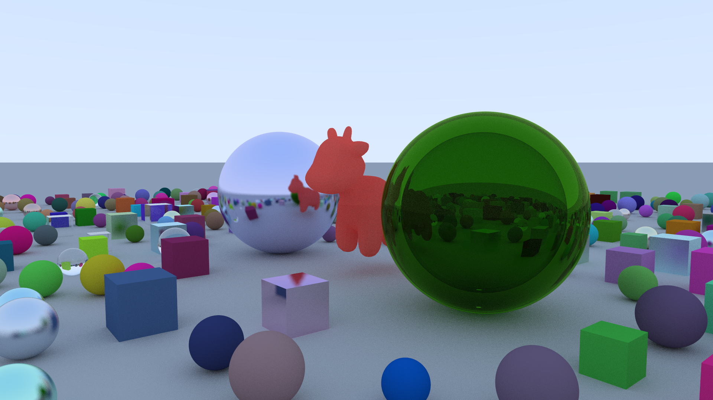

# Ray Tracing en C++

Para compilar el proyecto, es necesario instalar la librería ImageMagick (`sudo apt install 
imagemagick graphicsmagick-libmagick-dev-compat` en Ubuntu) para que el programa 
pueda convertir la imagen en formato PPM a formato PNG. Si se desea no utilizar esta 
funcionalidad, modificar el archivo `CMakeLists.txt` y descomentar la linea correspondiente.

Luego, el proyecto se puede compilar con los siguientes comandos:

```shell
$ cmake .
$ make
$ ./iow [ SCENEFILE [ OUTPATH ] ]
```

, donde `SCENEFILE` es un archivo de escena, y `OUTPATH` es el archivo de la imagen que se va a 
generar. Para ver el formato del archivo `SCENEFILE`, ver el archivo `scene_tutorial.txt`.

Se puede correr el programa sin argumentos, en ese caso se generará una escena aleatoria y se 
escribirá el resultado en `out.png`

## Escena Final


